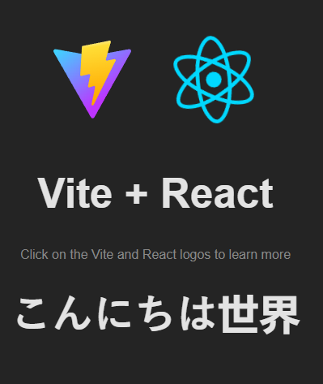

# i18next demo

A tutorial about i18next and how it can be utilized to add multiple language support to a react web application.

[A tutorial about i18next and how it can be utilized to add multiple language support to a react web application.](https://portfolio-guillaume-omega.vercel.app/)

